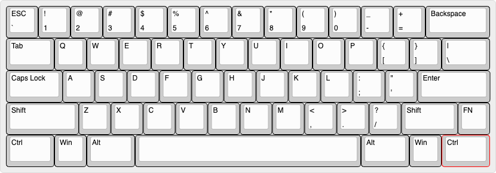
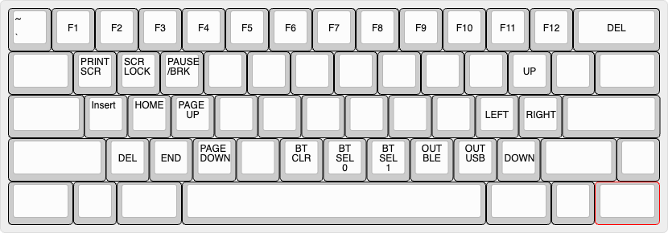

This repository is a guide on how to customize the keymaps for the TR60 keyboard, 
build it, download the firmware, and flash it to the keyboard.

The default keymaps of TR60 is shown below. (Primary layer and function layer)

If you want to learn more about the hardware please visit [this](https://github.com/hw-tinkerers/TR-60) link.

For a video tutorial on how to customize the keymap, visit [youtube-link](https://youtu.be/X8DzVzA3Ba4)

1. You need to fork this repository to your GitHub account to make any changes.
2. You only need to change the tr60.keymap file to change the keymap for your board to customize keys to your liking.
3. After you have made changes, please commit the changes and the firmware will start building under the Actions tab.
4. After the firmware has been built, you can download it, unzip and flash it to your board.
5. To flash the firmware, just double-press the reset button on the back of the PCB, and a drive named TR60 will appear. Just drag and drop the file with the .uf2 extension and wait for it to copy.
6. After this just unplug and plug the USB wire back in and enjoy your customized keymaps. 

Note: There is a default keymap firmware under assets/tr60-zmk.uf2, if you want to flash the default keymap again without building the firmware. 
